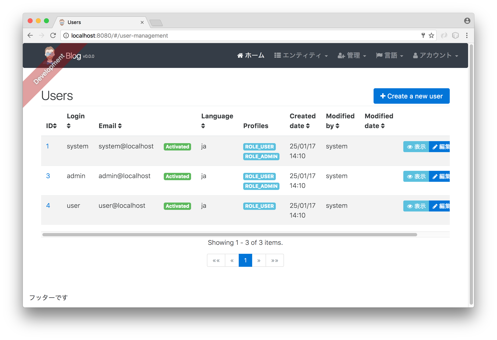
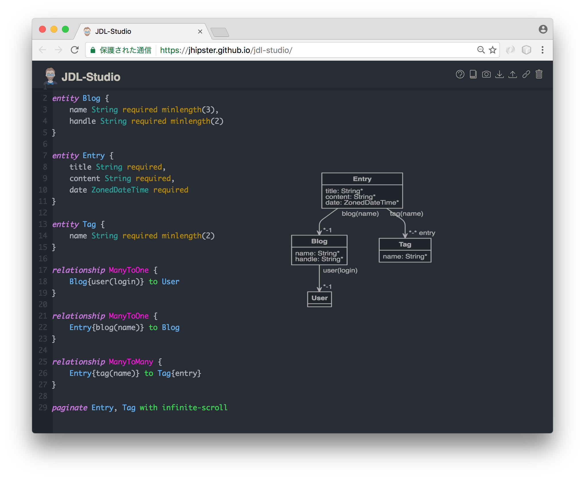
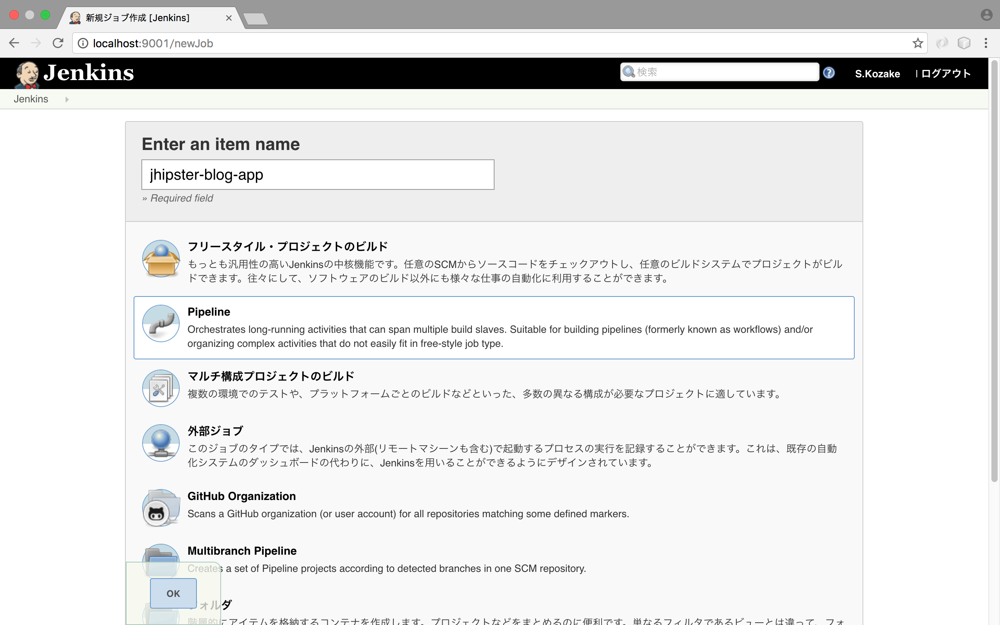

= JHipster 4 ハンズオン

このドキュメントは、
http://www.eclipse.org/community/eclipse_newsletter/2017/january/article3.php[Get Started with JHipster 4]
の内容を元に作成した https://jhipster.github.io/[JHipster] 4のハンズオン資料です。

1/25日現在、JHipster 4はまだリリースされておりません。
しかし、今後の開発ではAngular(2以降)での開発が主流になっていくと考えています。
そこで本ハンズオンでは、jHipsterのMasterブランチを用いてJHipster 4による開発を体験したいと思います。

== JHipster 4のインストール

http://jhipster.github.io/installation/[Installing JHipster]
にはリリーズ済みのJHipsterバージョンについて、必要なツールのインストール方法はありますが、
JHipster 4についてはまだ用意されていません。

そこで、JHipster 4に必要なツールのインストール方法を次に示します。

. Java 8のインストール http://www.oracle.com/technetwork/java/javase/downloads/index.html[from Oracle]
. Gitのインストール https://git-scm.com
. Node.jsのインストール http://nodejs.org. ここでは、Node 6.9.4を使ってハンズオンを用意しました。
. Yarnのインストール https://yarnpkg.com/en/docs/install[Yarn installation instructions]
. 次のコマンドを実行して http://yeoman.io/[Yeoman] をインストール

[source]
----
yarn global add yo
----

JHipster 4 はまだリリースされていないので、GitHubレポジトリからcloneし、
それを用いてアプリケーションのプロジェクトを作成します。

----
git clone https://github.com/jhipster/generator-jhipster
----

ローカルにクローンした後、`generator-jhipster` ディレクトリ下で `npm link` を実行します。
これにより、npmはダウンロードしたローカルコピーに代わり、これを使用します。

== Projectの作成

プロジェクトを作成するにあたり、ターミナルウィンドウ（コマンドプロンプト）を開きます。
任意のディレクトリ配下で、以下のコマンドを実行します。

----
mdkdir blog
cd blog
yo jhipster
----

blogディレクトリを作成し、そこにアプリケーションのプロジェクトを作成していきます。
`yo jhipster` コマンドを実行すると、生成するアプリケーションについてのいくつかの質問を聞かれるので、
必要な機能を選択していきます。

このハンズオンで選択した内容は次のスクリーンショットのとおりです。

.アプリケーション作成

空のディレクトリに次の `.yo-rc.json` ファイルをおいて、
`yo jhipster` コマンドを実行すると、これと同じアプリケーションを作成できます。

なお、packageNameやpackageFolderは適宜に変更してください。

[source,json]
----

  "generator-jhipster": {
    "jhipsterVersion": "3.12.2",
    "baseName": "blog",
    "packageName": "com.github.kozake.handson.jhipster.blog",
    "packageFolder": "com/github/kozake/handson/jhipster/blog",
    "serverPort": "8080",
    "authenticationType": "session",
    "hibernateCache": "no",
    "clusteredHttpSession": false,
    "websocket": false,
    "databaseType": "sql",
    "devDatabaseType": "h2Disk",
    "prodDatabaseType": "postgresql",
    "searchEngine": false,
    "messageBroker": false,
    "buildTool": "gradle",
    "enableSocialSignIn": false,
    "rememberMeKey": "13fab660b246ddc07f78b526a4d6952be45de79b",
    "useSass": false,
    "clientPackageManager": "yarn",
    "applicationType": "monolith",
    "clientFramework": "angular2",
    "testFrameworks": [
      "gatling",
      "protractor"
    ],
    "jhiPrefix": "jhi",
    "enableTranslation": true,
    "nativeLanguage": "ja",
    "languages": [
      "ja",
      "en"
    ]
  }
}
----

選択が完了すると、プロジェクトの作成処理が実行します。
実行が終わると、次のように出力されます。

.生成成功

`./gradlew` を実行すると、アプリケーションが起動します。

http://localhost:8080 をブラウザで起動してください。

ログインやユーザ登録の方法が書かれた次の画面が表示されます。

.デフォルトホームページ

上段のメニューバーにある、「アカウント -> 認証」を選択しでログイン画面を表示し、
ユーザ名 `admin` 、パスワード `admin` でログインしてください。

メニューバーに「管理」メニューが追加されます。
「管理」メニューは、管理者ユーザでログインした場合にのみ表示され、
次のようなアプリケーション管理用の画面が用意されています。

ユーザ管理

.ユーザ管理

アプリケーションメトリクス

.アプリケーションメトリクス
image::static/app-metrics.png[Application and JVM Metrics, 1437, scaledwidth=100%]

Swaggerドキュメント

.Swaggerドキュメント

別のターミナルウィンドウ（コマンドプロンプト）で次のコマンドを実行すると、
Protractorによるテストが実行され、アプリケーションが正しく動作していることが確認できます。

----
yarn run e2e
----

アプリケーションの動作確認が出来たら、Gitでソース管理しましょう。

Gitを用いることで、変更を簡単に管理することができるようになります。

----
git init
git add .
git commit -m "Project created"
----

== エンティティの作成

単純なCRUDアプリケーションを作成するだけでも、エンティティごとに次のものが必要となります。

* データベーステーブル
* Liquibase change set（データベースのマイグレーション設定）
* JPAエンティティクラス
* Spring Data `JpaRepository` インタフェース
* Spring MVC `RestController` クラス
* Angular モデル, ルーティング, コンポーネント, ダイアログ コンポーネント, サービス
* HTMLページ

さらに、ユニットテストや統合テスト、パフォーマンステストなども必要となります。

JHipster を用いると、これらのコードを全て自動生成できます。
自動生成には統合テストやパフォーマンステストも含まれます。

エンティティが外部キーを使用したリレーションを保持している場合、
そのリレーションに応じたコードの生成もできます。

JHipster はいくつかの方法で、エンティティのコード生成をサポートしています。

https://jhipster.github.io/creating-anentity/[エンティティサブジェネレータ]
はコマンドラインツールです。
質問に応答する形式でエンティティを生成できます。

https://jhipster.github.io/jdl-studio/[JDL-Studio]
はブラウザベースのGUIツールです。
JHipster Domain Language (JDL)を用いて、エンティティ設計ができます。

今回は、JDL-Studio を用いてエンティティを作成します。

次に示すのは、簡単なブログを作成するために必要な、
Blog、EntryとTagのエンティティ図とJDLのコードです。

.Blog エンティティ図

この http://bit.ly/jhipster-blog-jdl[URL] をクリックして、
次のファイルの内容をブラウザにコピー＆ペーストしてください。

.jhipster-jdl.jh
----
entity Blog {
	name String required minlength(3),
	handle String required minlength(2)
}

entity Entry {
	title String required,
	content String required,
	date ZonedDateTime required
}

entity Tag {
	name String required minlength(2)
}

relationship ManyToOne {
	Blog{user(login)} to User
}

relationship ManyToOne {
	Entry{blog(name)} to Blog
}

relationship ManyToMany {
	Entry{tag(name)} to Tag{entry}
}

paginate Entry, Tag with infinite-scroll
----

JHipster 4のentity generatorを使用するには、

**blogディレクトリ下で次のコマンドを実行する必要があります**。

さもないと、JHipster 3.xエンティティジェネレータが使用され、
AngularJSコードが大量に生成されます。

----
npm link generator-jhipster
----

JDL-Studioからファイルをダウンロードした後、
次のコマンドを実行すると、指定のファイルをインポートして、
エンティティやテストのコード、およびUIコードを生成します。

----
yo jhipster:import-jdl ~/Downloads/jhipster-jdl.jh
----

`~/Downloads/jhipster-jdl.jh` の部分は環境に応じて適宜変更してください。

`src/main/resources/config/liquibase/master.xml`
を上書きするかどうかを問われます。
このファイルや他のファイルを上書きするには `a` と入力してください。

`/ .gradlew` でアプリケーションを起動すると、生成したエンティティのCRUD画面が表示できます。

既存で用意されている `admin` と `user` ユーザでいくつかブログ記事を作成してみてください。

.Blogs

.Entries

その後、別のターミナルウィンドウ（コマンドプロンプト）を開いて、
Protractorによるテストを実行してください。

----
yarn run e2e
----

CRUD画面のテストが正しく動作していることが確認できます。

では、これまでの修正をコミットしましょう。

----
git add .
git commit -m "Entities generated"
----

== Gitbucketでのリポジトリ管理

現在、ローカルのgitリポジトリでのみアプリケーションを管理しています。

ここでは、Gitbucketサーバーでリモートリポジトリを作成し、
現在ローカルで管理しているGitリポジトリをリモートリポジトリで管理します。
リモートリポジトリが出来ることで、チームでの共同開発が可能となります。

Gitbucketは、GithubやBitcuketのようなSCMのためのウェブサービスです。

本来はチームで共有しているサーバーにGitbukcetサーバーを立てると思いますが、
今回のハンズオンではローカルにGitbukcetサーバーを構築し、
Gitbukcetを用いた開発を体験したいと思います。

https://github.com/gitbucket/gitbucket/releases[こちら] のページより、
gitbucketの最新リリースを取得できます。

最新の `gitbucket.war` をダウンロードし、任意のディレクトリに配置してください。

次のコマンドを実行すると、Gitbucketが9000番ポートで起動します。

----
java -jar gitbucket.war --port=9000
----

.Gitbucket

管理者ユーザが `root`、パスワードが `root` で用意されているので、
それでサインインします。

右上にあるメニューで `System administration` を選択し、適宜ユーザーを
作成してください。

.Gitbucket User management

作成したユーザで再ログインし、blogリポジトリを作成します。

右の`+` メニューから`New repository` を選択し、
リポジトリを作成します。

.Gitbucket Create a new repository

これでGitbucket上にリポジトリが作成出来ました。

すでにGitリポジトリは持っているので、ターミナルウィンドウ（コマンドプロンプト）を開き、
blogディレクトリ下で画面下に表示されている次のコマンドを実行します。

----
git remote add origin http://localhost:9000/git/kozake/blog.git
git push -u origin master
----

originの右に定義されているURLは各自の環境により異なるので注意してください。
コマンドを実行すると、ユーザとパスワードを聞かれますので、作成したユーザのものを
入力してください。

これで、Gitbucket上のリポジトリにソースをpushできました。

.Gitbucket blog repository

== Jenkinsでのビルド

Jenkinsサーバーでblogアプリケーションのジョブを作成し、ビルドを自動化しましょう。

JenkinsはCIツールと呼ばれるもので、アプリケーションの継続的インテグレーション開発を
サポートします。

https://jenkins.io/[こちら] のページよりJenkinsの最新リリースを取得できます。

`jenkins.war` をダウンロードし、任意のディレクトリに配置してください。

次のコマンドを実行すると、Jenkinsが9001番ポートで起動します。

----
java -jar jenkins.war --httpPort=9001
----

初回インストール時に、`admin` ユーザが自動生成され、
そのパスワードがターミナルウィンドウ（コマンドプロンプト）に表示されますので
そのパスワードを入力してください。

.Jenkins Getting Started

次に、よく使用されるプラグインをインストールするかどうかを聞かれます。
`Install suggested plugins` を選択してください。

.Jenkins Customize

.Jenkins Getting Started
image::static/jenkins-install-plugin.png[scaledwidth=100%]

プラグインのインストールが完了したら、次の画面が表示されます。
適宜、管理者ユーザを作成してください。

.Jenkins Create First Adin User

Jenkinsのホーム画面が表示されます。

.Jenkins Home

Jenkins2によるJHipsterのビルド作成手順は
https://jhipster.github.io/setting-up-ci-jenkins2/[こちら]を参照してください。

JHipsterが `Jenkinsfile` を生成してくれているので、簡単にジョブを作成できます。

`Enter an item name` に `jhipster-blog-app` を入力し、
`Pipeline` を選択します。

.Jenkins Create Job

Jobの設定画面にて、`Definition` に `Pipeline script from SCM`
`SCM` に `Git`
`Repository URL` にGitbucket上に作成したGitのURLを設定します。

.Jenkins Setting Job

これでJenkinsにジョブを生成できました。

.Jenkins Created Job
image::static/jenkins-created-job.png[scaledwidth=100%]

ジョブの右にある実行ボタンを押すと、ジョブが実行され、テスト実行、ビルド作成が行われます。

== ビジネスロジックの追加

現在、ユーザーはお互いのエントリーを見ることができます。
セキュリティ的にも好ましいものではないので、これを変更していきたいと思います。

TIP: JHipsterプロジェクトをIntellij IDEAで設定する場合、こちらをご覧ください。 https://jhipster.github.io/configuring-ide-idea/[Configuring Intellij IDEA].

ブログやエントリーのセキュリティを強化するために、
`BlogResource.java` を開き、 `getAllBlogs（）` メソッドを探して、

[source,java]
.src/main/java/org/jhipster/web/rest/BlogResource.java
----
List<Blog> blogs = blogRepository.findAll();
----

から

[source,java]
.src/main/java/org/jhipster/web/rest/BlogResource.java
----
List<Blog> blogs = blogRepository.findByUserIsCurrentUser();
----

に変更します。

`findByUserIsCurrentUser（）` メソッドは、JHipsterで既に生成されています。
`BlogRespository` クラスに定義されており、現在ログイン中のユーザが保持するのデータに
検索結果を絞り込むことができます。

[source,java]
.src/main/java/org/jhipster/repository/BlogRepository.java
----
public interface BlogRepository extends JpaRepository<Blog,Long> {

    @Query("select blog from Blog blog where blog.user.login = ?#{principal.username}")
    List<Blog> findByUserIsCurrentUser();

}
----

この変更を行った後、 http://docs.spring.io/spring-boot/docs/current/reference/html/using-boot-devtools.html[Spring Boot's Developer tools]
のおかげでアプリケーションが再起動し、 `BlogResource` が再コンパイルされます。

http://localhost:8080/blogs に移動すると、現在のユーザーのブログだけが表示されます。

.管理者ブログ

エントリーにも同じロジックを追加するために、 `EntryResource.java`　の、
`getAllEntries()` メソッドを探して、

[source,java]
.src/main/java/org/jhipster/web/rest/EntryResource.java
----
Page<Entry> page = entryRepository.findAll(pageable);
----

から

[source,java]
.src/main/java/org/jhipster/web/rest/EntryResource.java
----
Page<Entry> page = entryRepository.findByBlogUserLoginOrderByDateDesc(SecurityUtils.getCurrentUserLogin(), pageable);
----

に変更します。

また、次のメソッドを `EntryRepository` クラスに追加します。

[source,java]
.src/main/java/org/jhipster/repository/EntryRepository.java
----
Page<Entry> findByBlogUserLoginOrderByDateDesc(String currentUserLogin, Pageable pageable);
----

変更後クラスを再コンパイルし、 `user` ユーザのエントリだけを見れることを確認してください。

.Userのエントリー

変更をGitにコミットしましょう。

----
git add .
git commit -m "Add business logic"
----

== UIの変更

まだブログのようには見えません。
コンテンツフィールドにHTMLの記述が許可されていません。
見た目をブログのように変更していきましょう。

UIの開発を行う場合、変更が即時ブラウザで確認できたほうがいいですよね。

JHipster 4では、 https://www.browsersync.io/[Browsersync]と https://webpack.github.io/[webpack]を使用して
この機能を提供します。

`blog` ディレクトリで次のコマンドを実行してください。

----
npm start
----

このコマンドを実行すると、デフォルトブラウザが開き、 http://localhost:9000 で画面が表示されます。

このセクションでは、次の変更します。

. エントリの内容を `<input>` タグから `<textarea>` タグに変更します。
. HTMLをコンテンツに描画できるように変更します。
. ブログのようにエントリーの一覧を変更します。

==== コンテンツをtextareaへ

`entry-dialog.component.html` を開き、
`content` の `<input>` フィールドを `<textarea>` に変更してください。

この変更を行うと、次のようになります。

[source,html]
.src/main/webapp/app/entities/entry/entry-dialog.component.html
----
<textarea class="form-control" name="content" id="field_content" [(ngModel)]="entry.content"
          rows="5" required></textarea>
----

==== HTMLを許可

このフィールドにHTMLを入力すると、画面でエスケープされていることがわかります。

.エスケープされたHTML

これを変更するには、 `entry.component.html` を開いて次の行を、

[source,html]
.src/main/webapp/app/entities/entry/entry.component.html
----
<td>{{entry.content}}</td>
----

から

[source,html]
.src/main/webapp/app/entities/entry/entry.component.html
----
<td [innerHTML]="entry.content"></td>
----

に変更してください。

この変更で、HTMLがエスケープされなくなったことがわかります。

.HTMLで表示されたエントリー

変更をGitにコミットしましょう。

----
git add .
git commit -m "for html"
----

==== レイアウト変更

エントリの見た目をブログのようにするために、
`
` と `<table>` を次のHTMLで置き換えます。

[source,html]
.src/main/webapp/app/entities/entry/entry.component.html
----

= links['last']" [infiniteScrollDistance]="0">
    

        <h2>{{entry.title}}</h2>
        <small>Posted on {{entry.date | date: 'short'}} by {{entry.blog.user.login}}</small>
        

        

            <button type="submit"
                    [routerLink]="['/', { outlets: { popup: 'entry/'+ entry.id + '/edit'} }]"
                    class="btn btn-sm btn-primary">
                &nbsp; Edit
            </button>
            <button type="submit"
                    [routerLink]="['/', { outlets: { popup: 'entry/'+ entry.id + '/delete'} }]"
                    class="btn btn-sm btn-danger">
                &nbsp; Delete
            </button>
        

    

----

これで普通のブログのように見えます！

.Blog entries

変更をGitにコミットしましょう。

----
git add .
git commit -m "Changed layout"
----

== クラウドへデプロイ

JHipsterで作成したアプリケーションは、SpringBootアプリケーションをデプロイできる場所ならどこにでも配置できます。

次のクラウドサービスにデプロイできます。

* https://jhipster.github.io/cloudfoundry/[Cloud Foundry]
* https://jhipster.github.io/heroku/[Heroku]
* https://jhipster.github.io/kubernetes/[Kubernetes]
* https://jhipster.github.io/aws/[AWS]
* https://jhipster.github.io/boxfuse/[AWS with Boxfuse]

ここでは、Herokuにデプロイしてみます。

JHipsterアプリケーションを準備するにあたり、
事前に設定された "production"プロファイルを使用することをお勧めします。
Gradleの場合、ビルド時に `prod` プロファイルを指定します。

----
 ./gradlew bootRepackage -x test -Pprod
----

プロダクションプロファイルは、最適化されたJavaScriptクライアントを構築するために使用されます。
webpackを使って `yarn run webpack：prod`　を実行することでこれを呼び出すことができます。

また、プロダクションプロファイルでは、サーブレットフィルタによるgzip圧縮、キャッシュヘッダー、
および https://github.com/dropwizard/metrics[Metrics] による監視経由でを設定します。

`application-prod.yaml` ファイルで http://graphite.wikidot.com/[Graphite]サーバーが設定されている場合、
アプリケーションは自動的にメトリクスデータをそこに送ります。

このブログアプリケーションをHerokuにアップロードするには、
コマンドラインから `heroku login` を使ってHerokuアカウントにログインします。
https://devcenter.heroku.com/articles/heroku-command-line[Heroku CLI]がインストールされている必要があります。

----
$ heroku login
Enter your Heroku credentials.
Email: sh.kozake@gmail.com
Password (typing will be hidden):
Logged in as sh.kozake@gmail.com
----

http://jhipster.github.io/heroku/[Deploying to Heroku] ドキュメントで推奨されているように、
`yo jhipster：heroku` を実行しました。
アプリケーション名には "jhipster4-handson-blog"という名前を使用しました。

----
$ yo jhipster:heroku
Heroku configuration is starting
Deploying as existing app: jhipster-4-handson-blog

Using existing Git repository

Installing Heroku CLI deployment plugin

Provisioning addons
No new addons created

Creating Heroku deployment files
identical src/main/resources/config/bootstrap-heroku.yml
identical src/main/resources/config/application-heroku.yml
identical Procfile
identical gradle/heroku.gradle
identical build.gradle

Building application
...
BUILD SUCCESSFUL
Total time: 1 mins 18.258 secs

Deploying application

Uploading your application code.
This may take several minutes depending on your connection speed...
Uploading blog-0.0.1-SNAPSHOT.war
-----> Packaging application...

       - app: jhipster-4-handson-blog
       - including: build/libs/blog-0.0.1-SNAPSHOT.war
-----> Creating build...
       - file: slug.tgz
       - size: 44MB
-----> Uploading build...
       - success
-----> Deploying...
remote:
remote: -----> heroku-deploy app detected
remote: -----> Installing OpenJDK 1.8... done
remote: -----> Discovering process types

remote:        Procfile declares types -> web
remote:
remote: -----> Compressing...
remote:        Done: 92.2M
remote: -----> Launching...
remote:        Released v4

remote:        https://jhipster-4-handson-blog.herokuapp.com/ deployed to Heroku

remote:
-----> Done

Your app should now be live. To view it run
	heroku open
And you can view the logs with this command
	heroku logs --tail
After application modification, redeploy it with
	yo jhipster:heroku
----

`heroku open` を実行し、`admin` でログインできました！！

これで、インターネット上にサービスが提供されたのです。

.JHipster 4 demo on Heroku

